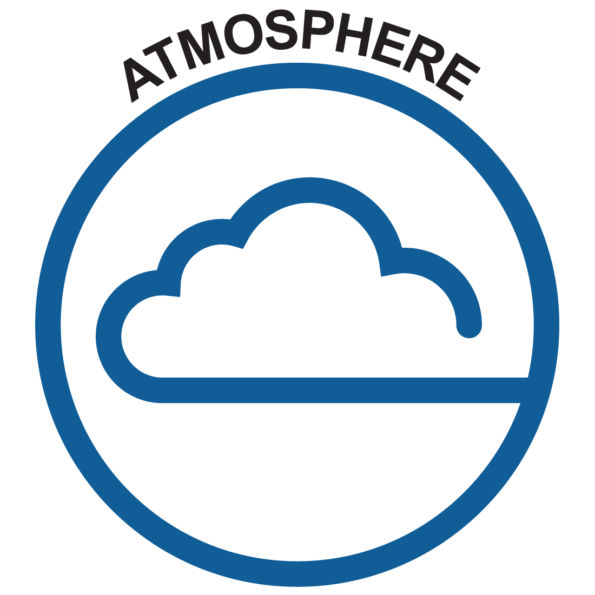

    

# Atmosphere Cookbook

An Atmosphere Cookbook 📔 of Recipes for analysing regional or global atmosphere model output. 👩🏽‍🍳 👨🏻‍🍳

A "recipe" is an example of an analysis of some atmosphere model output or some atmosphere-related observational datasets.
Each "recipe" comes in a self-contained and well-documented Jupyter notebook.
All the recipes combined form a cookbook 📒!

To access the data used in these recipes you need an account with the Australian-based [National Computational Infrastructure (NCI)](https://nci.org.au/).

To **get started**, clone this repository in your local space on one of the NCI HPC machines so you can have access to model output. You should then be able to run these recipes (i.e., example analyses) through an [Australian Research Environment (ARE)](https://are.nci.org.au/) JupyterLab session running python or via any other way you might want to run a Jupyter notebook on an NCI HPC machine. You need to join projects _hh5_, _xp65_, and _ua8_ to run the recipes and access the data analysed.

If you plan to use an ARE session, then remember to include the projects in the _Storage_ line: `gdata/hh5+gdata/xp65+gdata/ua8` as well as any of your own project you need access to. In _Module directories_, set `/g/data/hh5/public/modules` and in _Modules_ set `conda/analysis3`. Use a _Compute Size_ of `large` or greater.

If you have never used the NCI see these [first steps instructions](https://access-hive.org.au/getting_started/first_steps/) and [getting started with ARE](https://access-hive.org.au/getting_started/are/).

### Contributing

Have you made a recipe for analysing something that is not already included in this cookbook?
You are more than welcome to share it and include it in the cookbook!
Consider **contributing your recipe back to the repository**.
We are always delighted to expand our cookbook with more recipes.
If the process of contributing to the repository sounds a bit intimidating to you, rest assured that we will guide you and help you with submitting your contribution.

To make a contribution just raise [an issue](https://github.com/21centuryweather/atmospheric-cookbook/issues) explaining briefly what the contribution you want to make is and we'll help out with the process!

## Contents

### [Tutorials](https://atmospheric-cookbook.readthedocs.io/en/latest/tutorials.html)
Tutorials that get you started.

### [Recipes](https://atmospheric-cookbook.readthedocs.io/en/latest/recipes.html)
The main part of this cookbook: All the recipes! These are Jupyter notebooks for either simple or not-so-simple diagnostics and analyses. All notebooks aim to be self-contained, well-documented and explained.
If you can find a recipe that suits your purpose, then this is a great place to start.

## Credits

The structure and content of this repository draws inspiration from the [Consortium for Ocean-Sea Ice Modelling in Australia (COSIMA)](http://cosima.org.au/)'s [Cookbook repository](https://github.com/COSIMA/cosima-recipes) that holds recipes for analysing ocean-sea ice model output.

